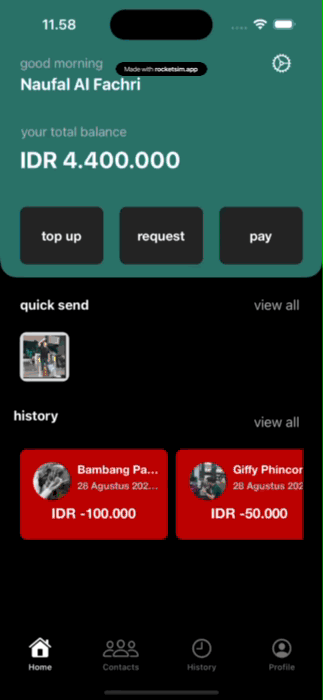
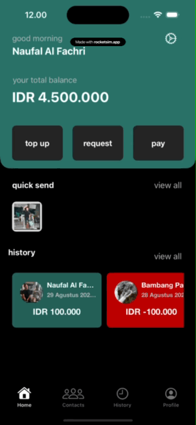
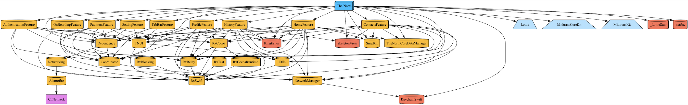
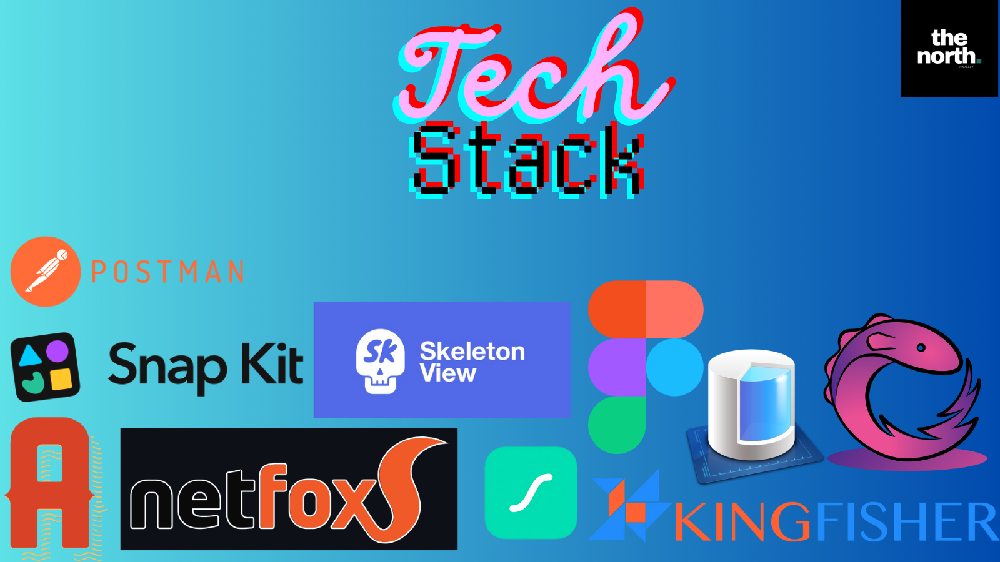

# The North Pay

***The North Pay is an iOS e-wallet application built using a modular architecture powered by Tuist and designed with the MVVMC pattern. The app provides users with a seamless experience for generating QR codes, scanning QR codes, topping up their wallet, and transferring funds to their contacts.***

<div align="center">
  
</div>

## Features

- Generate QR codes for transactions.
- Scan QR codes for payments.
- Top-up wallet balance.
- Transfer money to contacts securely.
- Modern UI with animations and placeholders.

| Top Up | Generate QR | Scan QR | Transfer |
|--------------------|-------------------|--------------------|--------------------|
|  |  |  |  |


## Table of Contents

- [Installation](#installation)
- [Modules](#modules)
- [Design Patterns](#design-patterns)
- [Dependencies](#dependencies)
  - [Alamofire](#alamofire)
  - [Kingfisher](#kingfisher)
  - [RxSwift](#rxswift)
  - [SkeletonView](#skeletonview)
  - [SnapKit](#snapkit)
  - [KeychainSwift](#keychainswift)
  - [Lottie](#lottie)
  - [Netfox](#netfox)
  - [CoreData](#coredata)
- [Architecture](#architecture)
- [Future Improvements](#future-improvements)

## Installation

The North Pay uses [Tuist](https://tuist.io/) for project generation and [Swift Package Manager](https://swift.org/package-manager/) for dependency management.

Follow these steps to set up the project:

1. Clone the repository:
   ```bash
   git clone https://github.com/yourusername/TheNorthPay.git
   cd TheNorthPay

2. Install Tuist if you don't have it:
    ```bash
    curl -Ls https://install.tuist.io | bash
3. Go to the folder path and open the terminal then cd + project path

4. Install the necessary version of Tuist defined in the project
    ```bash
    tuist install
5. Generate the Xcode project:
    ```bash
    tuist generate

# Modules
The North Pay follows a modular architecture. Each feature is organized into its own module to promote separation of concerns and scalability. For example:



- **HomeModule**: Handles the home dashboard.
- **QRCodeModule**: Manages QR code generation and scanning functionality.
- **PaymentModule**: Manages top-up and transfer services.
- **ProfileModule**: Handles user profiles and preferences.

Each module is self-contained, making it easier to maintain and develop features independently.

# Design Patterns
This project adopts the Model-View-ViewModel-Coordinator (MVVMC) design pattern. MVVMC separates business logic, UI rendering, and data handling into distinct layers, promoting better code organization and testability.


- **Model**: Represents data and business logic.
- **View**: Displays UI elements and reacts to user actions.
- **ViewModel**: Acts as the intermediary between the Model and the View. It holds presentation logic and prepares data for the View.
- **Coordinator**: Handle navigation between the View

# Dependencies or Tech Stack



### **Alamofire**
Alamofire is used for making network requests within the app. It simplifies networking code and handles tasks like HTTP requests, JSON parsing, and network validation.

- **Use Case**: Fetching data from a backend API (e.g., transaction history, user details, top-up status).

### **Kingfisher**
Kingfisher is a lightweight library for downloading and caching images.

- **Use Case**: Loading and caching contact profile pictures in the Transfer section.

### **RxSwift**
RxSwift enables reactive programming in Swift. It allows the use of Observables, Subjects, and other reactive patterns to manage asynchronous events and data streams.

- **Use Case**: Binding UI components like buttons and text fields to the ViewModel, handling QR code scanning results, and managing user input validation.

### **SkeletonView**
SkeletonView provides skeleton loading views that mimic the structure of the UI, providing users with visual feedback during data loading.

- **Use Case**: Displaying skeleton views while waiting for data like transaction history or profile info to load.

### **SnapKit**
SnapKit is a DSL for Auto Layout, making it easier to define constraints programmatically in a readable format.

- **Use Case**: Building dynamic UI layouts for screens like payment confirmation, top-up forms, and profile screens.

### **KeychainSwift**
KeychainSwift is a helper library for securely storing sensitive information like tokens and credentials in the iOS Keychain.

- **Use Case**: Storing and retrieving user authentication tokens, ensuring secure login sessions.

### **Lottie**
Lottie provides animations via JSON files. It allows for rich, scalable animations without impacting performance.

- **Use Case**: Showing success animations after completing a transaction or top-up.

### **Netfox**
Netfox is a network debugging tool that logs all network requests and responses in the app.

- **Use Case**: Debugging and monitoring all network activity for the application.

### **CoreData**
CoreData is Apple's persistence framework. It stores data locally, such as user contacts or recent transactions, and allows offline access.

- **Use Case**: Storing contact information and transaction history locally to optimize the app's performance and enable offline access.

# The North Pay - Project Structure

This project is an e-wallet application built using Swift, leveraging a modular architecture via Tuist, and utilizing the MVVMC design pattern. It supports features such as generating and scanning QR codes, topping up accounts, and transferring funds to contacts.

## Features Overview

### Modular Architecture
The project is divided into modules to maintain clean, scalable, and reusable code. Each feature has its own folder for separation of concerns and to improve maintainability.

### Project Structure

```plaintext
The North
├── Project
│   ├── .build
│   ├── App
│   │   ├── Resources
│   │   ├── Sources
│   │   └── Info
│   ├── Derived
│   ├── Features
│   │   ├── AuthenticationFeature
│   │   │   ├── Sources
│   │   │   └── Resources
│   │   ├── ContactsFeature
│   │   │   ├── Sources
│   │   │   └── Resources
│   │   ├── HistoryFeature
│   │   │   ├── Sources
│   │   │   └── Resources
│   │   ├── HomeFeature
│   │   │   ├── Sources
│   │   │   └── Resources
│   │   ├── OnBoardingFeature
│   │   │   ├── Sources
│   │   │   └── Resources
│   │   ├── PaymentFeature
│   │   │   ├── Sources
│   │   │   └── Resources
│   │   ├── ProfileFeature
│   │   │   ├── Sources
│   │   │   └── Resources
│   │   ├── SettingFeature
│   │   │   ├── Sources
│   │   │   └── Resources
│   │   ├── TabBarFeature
│   │   │   ├── Sources
│   │   │   └── Resources
│   ├── Foundations
│   │   ├── Coordinator
│   │   │   ├── Sources
│   │   │   └── Resources
│   │   ├── Dependency
│   │   │   ├── Sources
│   │   │   └── Resources
│   │   ├── Networking
│   │   │   ├── Sources
│   │   │   └── Resources
│   │   ├── NetworkManager
│   │   │   ├── Sources
│   │   │   └── Resources
│   │   ├── TheNorthCoreDataManager
│   │   │   ├── Sources
│   │   │   └── Resources
│   │   ├── TNUI
│   │   │   ├── Sources
│   │   │   └── Resources
│   │   ├── Utils
│   │   │   ├── Sources
│   │   │   └── Resources
├── Frameworks
├── Dependencies
│   ├── Alamofire
│   ├── Kingfisher
│   ├── RxSwift
│   ├── SkeletonView
│   ├── SnapKit
│   ├── KeychainSwift
│   ├── Lottie
│   └── netfox
```

## TODOs

Keep track of tasks, improvements, and future plans for our project.

- [ ] Implement SnapKit in all project
- [ ] Implement Search Bar for contact and history VC
- [ ] Add diagram/graph feature for expense and income statistic
- [ ] Share the receipt to Instagram Stories
- [ ] Push Notification after user generata QR and success receive the money
- [ ] Edit theme in AppSettingsVC using Color well
- [ ] Implement SkeletonView in Home and Profile VC
